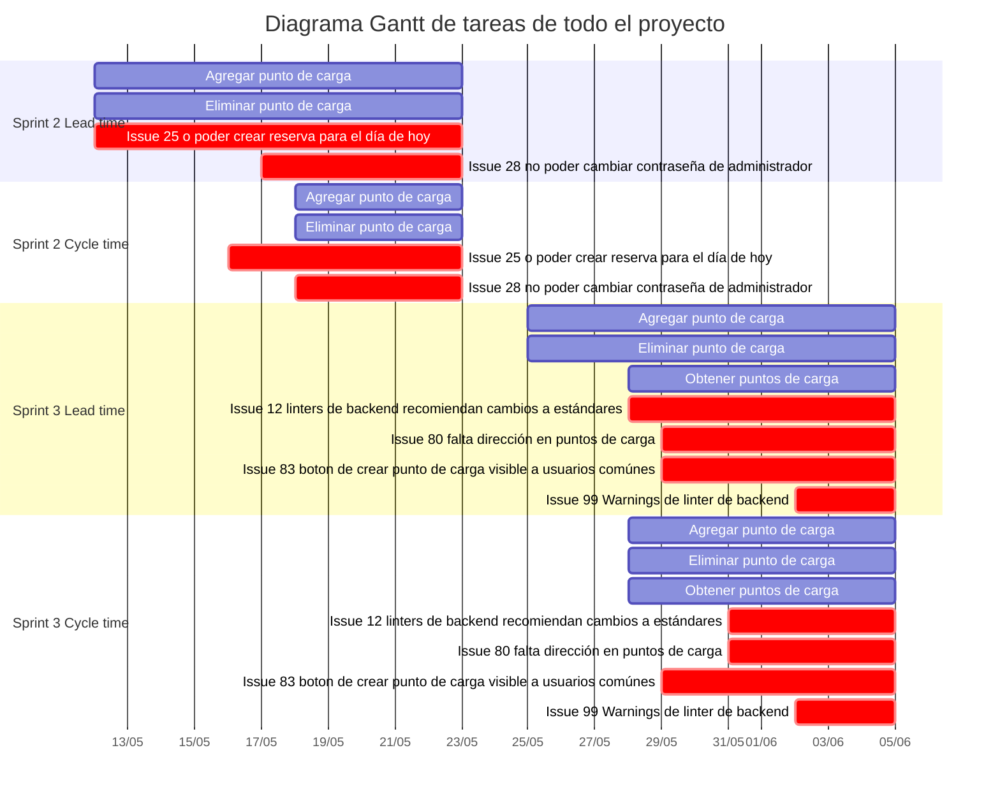
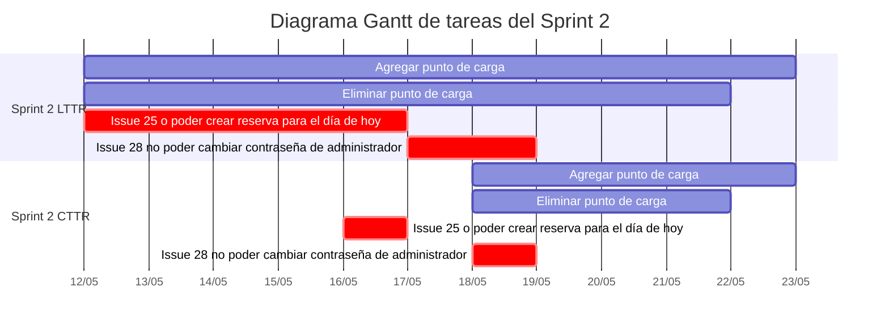
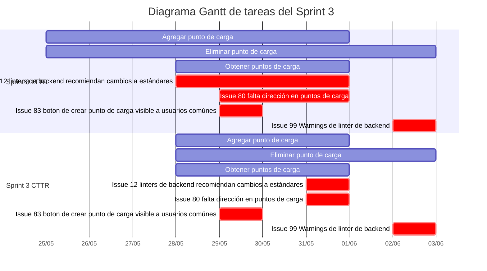
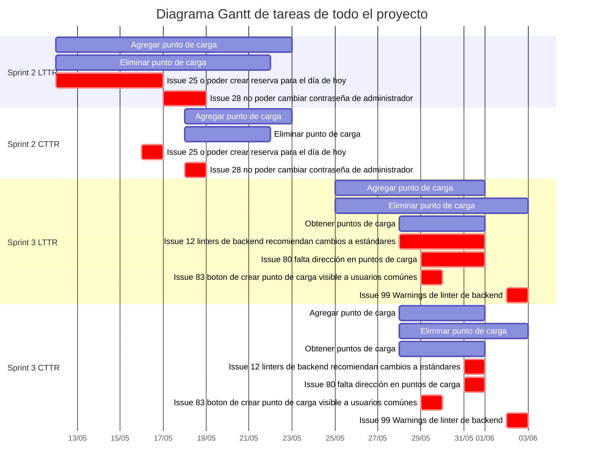

# Métricas <!-- omit in toc -->

###### tags: `Sprint 1` `Sprint 2` `Sprint 3` <!-- omit in toc -->

## Índice <!-- omit in toc -->

- [Métricas de issues](#métricas-de-issues)
  - [Sprint 1](#sprint-1)
  - [Sprint 2](#sprint-2)
  - [Sprint 3](#sprint-3)
- [Métricas de Pull Requests](#métricas-de-pull-requests)
  - [Sprint 1](#sprint-1-1)
  - [Sprint 2](#sprint-2-1)
  - [Sprint 3](#sprint-3-1)
- [Lead time y Cycle time](#lead-time-y-cycle-time)
  - [Sprint 2](#sprint-2-2)
    - [Lead time to Review](#lead-time-to-review)
      - [Resultado](#resultado)
      - [Conclusiones](#conclusiones)
    - [Cycle time to Review](#cycle-time-to-review)
      - [Resultado](#resultado-1)
      - [Conclusiones](#conclusiones-1)
  - [Sprint 3](#sprint-3-2)
    - [Lead time to Review](#lead-time-to-review-1)
      - [Resultado](#resultado-2)
      - [Conclusiones](#conclusiones-2)
    - [Cycle time to Review](#cycle-time-to-review-1)
      - [Resultado](#resultado-3)
      - [Conclusiones](#conclusiones-3)
  - [Comparaciones entre Sprints](#comparaciones-entre-sprints)

---

## Métricas de issues

Los issues estan categorizados y priorizados con labels creadas en github.
Hay que destacar que los mismos pueden tener mas de una categoría, por ejemplo, documentation y configuration. Cada issue tiene un solo nivel de prioridad, exceptuando los repetidos.

### Sprint 1

- **Creados: 20**
- **Abiertos: 13**
- **Cerrados: 7**

Uno de los objectivos principales del primer sprint era tener un primer contacto con el material a mantener y detectar y reportar todos los problemas que encontremos a través de diferentes técnicas:

- Testing Exploratorio
- Análisis de código
- Análisis de deuda técnica con NDepend

Es por esto que se reportaron 20 issues on total, aunque la mayoría no se cerraron ya que pertenecían al material recibido y resolverlos todos no entraba en el alcance del obligatorio.

Los issues estuvieron distribuidos en tres categorias, la mayoría fueron bugs, como era de esperarse, ya que una parte del sprint consistió en hacer testing exploratorio.
El resto fueron de configuración y documentación, que fueron generalmente issues introducidos por nosotros a la hora de subir los archivos del proyecto o de agregar linters a backend y frontend.

En cuanto a las prioridades, entendemos que es correcto que la mayoría estén en prioridad baja y media, ya que como se mencionó anteriormente, muchos de los issues salieron a partir de testing exploratorio en el frontend y los problemas que encontramos eran detalles o problemas que no afectaban el uso normal de la aplicación.

### Sprint 2

- **Creados: 3**
- **Abiertos: 1**
- **Cerrados: 2**

En este sprint nos centramos en el desarrollo de features y arreglo de bugs, por lo cual es esperable que la cantidad de issues creados se haya reducido, pues no hicimos testing obligatorio por ejemplo.

Teniendo en cuenta lo explicado anteriormente, es esperable tener pocos issues, los creados fueron por problemas de workflow, test y linters.

Lo que podemos destacar de la prioridad es que el issue marcado como inválido no tiene prioridad pues ya estaba arreglado, por lo cual es esperable tener un issue sin prioridad.

### Sprint 3

- **Creados: 11**
- **Abiertos: 8**
- **Cerrados: 3**

En este sprint decidimos realizar una instancia de análisis de código, aunque ya habíamos reportado issues relacionados en las iteraciones pasadas. Es por eso que la cantidad de issues aumentó con respecto al sprint 2.

Decidimos usar el label de invalid para los problemas de codificación, por lo cual es esperable que la mayoría pertenezcan a esta categoria teniendo en cuenta que dedicamos una instacia a hacer análisis de código. El resto fueron encontrados durante el desarrollo de las features.

A diferencia de los sprints anteriores en este hay una mayor cantidad de issues de prioridad media, ya que algunos de los issues de codigo consideramos que deben ser arreglados, además de issues acerca de las features que estabamos realizando que también debíamos arreglar y categorizamos con prioridad media.
Por lo tanto también es esperable que hayan más issues de prioridad media. Haciendo un paralelismo con la distribución de prioridades del sprint 1, podemos concluir que el testing exploratorio de frondend generalmente resulta en issues de menor prioridad que el análisis de código, ya que problemas en el último pueden afectar de manera más severa al resto del proyecto.

## Métricas de Pull Requests

Desde el comienzo se eligió seguir un desarrollo trunk-based, lo que implicó que todos en el equpo nos comprometiéramos a crear ramas cortas e integrarlas en menos de un día a nuestra rama principal. Se categorizan a los pull requests con labels que describen los cambios que incluyen. Cabe aclarar que un pull request puede tener más de una label ya que hay cambios que incluyen más de una categoría.

En principio se habían definido un conjunto más acotado de categorías ya que no habíamos considerado ciertos cambios que haríamos más adelante. Luego, vimos que las que definimos originalmente no bastaban para representar todos los tipos de pull requests que se estaban haciendo, por lo cual redefinimos estas y tomamos la dicisión de cambiar algunas categorías que ya estaban definidas en pull requests previos.

### Sprint 1

- **Creados: 18**
- **Abiertos: 0**
- **Cerrados: 18**
  

  Debido a que en el primer sprint no se agregaron nuevas funcionalidades y nos enfocamos especialmente en definir procesos y analizar deuda técnica, este sprint tuvo agregados principalmente de documentación y algunas configuraciones por el uso linters y herramientas (como commitizen) que decidimos utilizar. Si bien hay tres pull requests categorizados como fix, estos hacen referencia a problemas con los que que nos encontramos al subir el proyecto al repositorio, y no sobre bugs que hayamos encontrado en la aplicación.

### Sprint 2

- **Creados: 25**
- **Abiertos: 0**
- **Cerrados: 25**
  

  En el segundo sprint agregamos dos nuevas funcionalidades (únicamente en el backend) que justifican un mayor uso de la categoría enhancement, y a su vez, la de test (ya que seguimos las prácticas de TDD y BDD). Además de esto, se arreglaron dos bugs que encontramos en la aplicación y ambos fueron categorizados como fix en el pull request que los arregla. Sobre la documentación, tiene una proporción mayor ya que fuimos documentando guías y actualizando documentos justificando lo hecho.

### Sprint 3

- **Creados: 44**
- **Abiertos: 0**
- **Cerrados: 44**
  

  En el tercer sprint se agregaron las funcionalidades del sprint anterior al frontend, a su vez utilizando Selenium para realizar pruebas funcionales. Es por ello que hubo una cantidad razonable de pull requests categorizados como enhancement y test. Cabe destacar también que, por primera vez, se utilizó la categoría refactor. Esto se debe a que mejoramos código de sprints anteriores y por el mantenimiento de la aplicación en general, donde encontramos que en varios lugares no se seguía con Clean Code y estándares de codificación. La documentación, al igual que en los sprints anteriores, se fue actualizando a medida que avanzábamos en el obligatorio.

---

## Lead time y Cycle time

En un principio tomamos para Lead time cuando entre una tarjeta al backlog y para Cycle time cuando empieza a ser trabajada, y para ambas tomabamos el final como el momento en que llega a la columna Done.

Por como definimos nuestro proceso de ingeniería, al realizar una sprint review al final de la iteración, quedando todas las tareas pendientes en Waiting For Review, el diagrama de Gantt representantivo de estas métricas no brinda mucha información ya que para toda tarea que comenzó al principio del sprint, su tiempo total era el tiempo hasta el final del sprint.

La única información que se podía notar era cuando se agregaban tareas a lo largo del sprint.

Por este motivo para lead time y cycle time tomamos como punto de fin de las tareas la llegada a "esperando por review", ya que de lo contrario se tendría para la mayoría de las tareas un tiempo de la iteración completa, resultando en Lead Time to Review (LTTR) y Cycle Time to Review (CTTR).

De todos modos al trabajar con Trunk Based Development, las funcionalidades se fueron mergeando a main a lo largo de la iteración por lo cual estas funcionalidades ya estarían en la rama principal antes de la review.

**Cuentas**

$$ {Lead} \space {Time} \space {to} \space {Review} \space {promedio} = {T_{task1} + T_{task2} + ... T_{taskn} \over n} $$
$$ {Cycle} \space {Time} \space {to} \space {Review} \space {promedio} = {T_{task1} + T_{task2} + ... T_{taskn} \over n} $$

### Sprint 2

#### Lead time to Review

| Tarea                                                                                                                                        | Día Inicial | Día Final  | Días en desarrollo |
| -------------------------------------------------------------------------------------------------------------------------------------------- | ----------- | ---------- | ------------------ |
| Agregar punto de carga                                                                                                                       | 12/05/2022  | 22/05/2022 | 11                 |
| Eliminar punto de carga                                                                                                                      | 12/05/2022  | 21/05/2022 | 10                 |
| [Issue #25 no poder crear reserva para el día de hoy](https://github.com/ORT-ISA2-2022S1/obligatorio-decuadra_ferrari_meerhoff/issues/25)    | 12/05/2022  | 16/05/2022 | 5                  |
| [Issue #28 no poder cambiar contraseña de administrador](https://github.com/ORT-ISA2-2022S1/obligatorio-decuadra_ferrari_meerhoff/issues/28) | 17/05/2022  | 18/05/2022 | 2                  |

##### Resultado

$$ {Lead} \space {Time} \space {to} \space {Review} \space {promedio} = {T_{agregar} + T_{eliminar} + T_{Issue 25} + T_{Issue 28} \over 4} = 7 $$

##### Conclusiones

El segundo sprint sirve como base para medir el siguiente, ya que fue el primero en tener tareas que podíamos medir para métricas de LTTR y CTTR. En este sprint en particular se puede notar como las tareas relacionadas a BDD no fueron completadas hasta casi el final de la iteración, mientras que los bugs fueron resueltos temprano en la iteración.

#### Cycle time to Review

| Tarea                                                                                                                                        | Día Inicial | Día Final  | Días en desarrollo |
| -------------------------------------------------------------------------------------------------------------------------------------------- | ----------- | ---------- | ------------------ |
| Agregar punto de carga                                                                                                                       | 18/05/2022  | 22/05/2022 | 5                  |
| Eliminar punto de carga                                                                                                                      | 18/05/2022  | 21/05/2022 | 4                  |
| [Issue #25 no poder crear reserva para el día de hoy](https://github.com/ORT-ISA2-2022S1/obligatorio-decuadra_ferrari_meerhoff/issues/25)    | 16/05/2022  | 16/05/2022 | 1                  |
| [Issue #28 no poder cambiar contraseña de administrador](https://github.com/ORT-ISA2-2022S1/obligatorio-decuadra_ferrari_meerhoff/issues/28) | 18/05/2022  | 18/05/2022 | 1                  |

##### Resultado

$$ {Cycle} \space {Time} \space {to} \space {Review} \space {promedio} = {T_{agregar} + T_{eliminar} + T_{Issue 25} + T_{Issue 28} \over 4} = 2.75=> 3 $$

##### Conclusiones

El cycle del sprint 2 muestra como el LTTR se vió afectado principalmente por el tiempo que llevo comenzar con las tareas, ya que aún no habíamos aprendido ni definido el uso de SpecFlow para las pruebas de BDD, y esto representó más de la mitad del tiempo contado en LTTR.

El diagrama siguiente es una representación de las tareas a lo largo del sprint y su tiempo de vida. Estan separadas por secciones de LTTR y CTTR que permite visualizar la diferencia entre estos mencionada previamente.

---

### Sprint 3

#### Lead time to Review

| Tarea                                                                                                                                                    | Día Inicial | Día Final  | Días en desarrollo |
| -------------------------------------------------------------------------------------------------------------------------------------------------------- | ----------- | ---------- | :----------------- |
| Agregar punto de carga                                                                                                                                   | 25/05/2022  | 31/05/2022 | 7                  |
| Eliminar punto de carga                                                                                                                                  | 25/05/2022  | 02/06/2022 | 9                  |
| Obtener puntos de carga                                                                                                                                  | 28/05/2022  | 31/05/2022 | 4                  |
| [Issue #12 linters de backend recomiendan cambios a estándares](https://github.com/ORT-ISA2-2022S1/obligatorio-decuadra_ferrari_meerhoff/issues/12)      | 28/05/2022  | 31/05/2022 | 4                  |
| [Issue #80 falta dirección en puntos de carga](https://github.com/ORT-ISA2-2022S1/obligatorio-decuadra_ferrari_meerhoff/issues/80)                       | 29/05/2022  | 31/05/2022 | 3                  |
| [Issue #83 boton de crear punto de carga visible a usuarios comúnes](https://github.com/ORT-ISA2-2022S1/obligatorio-decuadra_ferrari_meerhoff/issues/83) | 29/05/2022  | 29/05/2022 | 1                  |
| [Issue #99 Warnings de linter de backend](https://github.com/ORT-ISA2-2022S1/obligatorio-decuadra_ferrari_meerhoff/issues/99)                            | 02/06/2022  | 02/06/2022 | 1                  |

##### Resultado

$$ {Lead} \space {Time} \space {to} \space {Review} \space {promedio} = {T_{agregar} + T_{eliminar} + T_{obtener} + T_{Issue 12} + T_{Issue 80} + T_{Issue 83} + T_{Issue 99} \over 7} = 4.14 => 5 $$

##### Conclusiones

En el tercer sprint se pudo aplicar lo aprendido en la iteración anterior además del conocimiento relacionado a automatización de testing funcional por la presentación de selenium que dimos en paralelo.

Esto llevo a que se pudiera temprano en la iteración comenzar a avanzar con las tareas relacionadas a BDD, disminuyendo en comparación a la iteración anterior el tiempo que llevo traer una tarea de ToDo a waiting for review.

#### Cycle time to Review

| Tarea                                                                                                                                                    | Día Inicial | Día Final  | Días en desarrollo |
| -------------------------------------------------------------------------------------------------------------------------------------------------------- | ----------- | ---------- | ------------------ |
| Agregar punto de carga                                                                                                                                   | 28/05/2022  | 31/05/2022 | 3                  |
| Eliminar punto de carga                                                                                                                                  | 28/05/2022  | 02/06/2022 | 5                  |
| Obtener puntos de carga                                                                                                                                  | 28/05/2022  | 31/05/2022 | 3                  |
| [Issue #12 linters de backend recomiendan cambios a estándares](https://github.com/ORT-ISA2-2022S1/obligatorio-decuadra_ferrari_meerhoff/issues/12)      | 31/05/2022  | 31/05/2022 | 1                  |
| [Issue #80 falta dirección en puntos de carga](https://github.com/ORT-ISA2-2022S1/obligatorio-decuadra_ferrari_meerhoff/issues/80)                       | 31/05/2022  | 31/05/2022 | 1                  |
| [Issue #83 boton de crear punto de carga visible a usuarios comúnes](https://github.com/ORT-ISA2-2022S1/obligatorio-decuadra_ferrari_meerhoff/issues/83) | 29/05/2022  | 29/05/2022 | 1                  |
| [Issue #99 Warnings de linter de backend](https://github.com/ORT-ISA2-2022S1/obligatorio-decuadra_ferrari_meerhoff/issues/99)                            | 02/06/2022  | 02/06/2022 | 1                  |

##### Resultado

$$ {Cycle} \space {Time} \space {to} \space {Review} \space {promedio} = {T_{agregar} + T_{eliminar} + T_{obtener} + T_{Issue 12} + T_{Issue 80} + T_{Issue 83} + T_{Issue 99} \over 7} = 2.56 => 3 $$

##### Conclusiones

Se nota en esta iteración como el CTTR esta más acercado al LTTR que en la iteración anterior, demostrando que transcurrió menos tiempo entre que se comenzó o se agregó las tareas a ToDo al momento en que se comenzaron a trabajar. Esto último ocurrió por la presencia de conocimento de las herramientas a utilizar en el sprint como se menciono en el LTTR.

El diagrama siguiente es una representación de las tareas a lo largo del sprint y su tiempo de vida. Estan separadas por secciones de LTTR y CTTR que permite visualizar como el LTTR esta bastante acercado al CTTR.

---

### Comparaciones entre Sprints

| Atributo             | Sprint 1    | Sprint 2 | Sprint 3 |
| -------------------- | ----------- | -------- | -------- |
| Lead time to Review  | No se midió | 7        | 5        |
| Cycle time to Review | No se midió | 3        | 3        |

En la siguiente gráfica se puede ver la evolución de las métricas de CTTR y LTTR time del proyecto, donde se puede notar que en el Sprint 1 no se registran estas métricas por la ausencia de nuevas funcionalidades y la de resolución de issues.

También se puede ver como a medida que se progreso en el proyecto, las métricas o bien se mantuvieron en su valor o dismuyeron, lo cual sería una mejora. De todos modos al ser una cantidad baja de iteraciones y tareas, sería muy temprano en el proyecto como para sacar conclusiones definitivas con respecto a estas métricas.

Lo que si puede evaluarse es que una vez que el equipo fue definiendo estándares, prácticas y conociendo las nuevas herramientas, se volvió más eficiente el trabajo por la ausencia de instancias requeridas (al estilo de spikes) para profundizar más como por ejemplo se escribirían los escenarios para las pruebas de BDD o como se podía realizar correctamente pruebas con Selenium.

**Line Graph de Lead time to Review y Cycle time to Review**

El diagrama siguiente es una representación de las tareas a lo largo del proyecto y su tiempo de vida. Estan separadas por secciones de LTTR y CTTR que permite visualizar la gran diferencia en el primer sprint entre estos y como en el segundo sprint esta fue menor.

